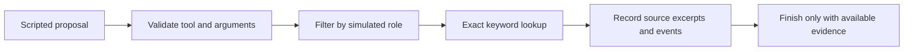

# 02 — Build an inspectable tool-execution boundary

[Guide index](README.md) · [繁體中文](../zh-Hant/02-bounded-lookup.md)

## What we are building

Suppose a colleague asks how to request system access. This example looks up the procedure in two invented documents and returns the matching text. We will also check what happens when the lookup fails or the caller has the wrong simulated role.

We use scripted proposals here so you can follow every step. There is no model choosing tools yet. The validation and stopping rules are the parts you would keep when adding one.

## 1. Run from the repository root

The verified runtime is CPython 3.14.5. Other interpreter versions have not been executed in this audit.

```sh
python3 examples/bounded_lookup/run.py
python3 -m unittest discover -s tests -v
```

There are no third-party dependencies, credentials or network calls. Check the [validation record](../../evidence/VALIDATION.md) and [actual output](../../evidence/demo-output.json).

## 2. Look at what the function accepts

Open [run.py](../../examples/bounded_lookup/run.py). It contains two invented procedures. `it` and `finance` are simulated roles supplied by the caller, not authenticated identities. All fixture data is visible in the public source.

`proposals` must be a prebuilt list or tuple. `role` must be an allowed string, `fail_once` a boolean, and `max_steps` an integer from 1 to 10. Invalid configuration raises `ValueError`; invalid proposals return `REJECTED`.

Each proposal has exactly `tool` and `args`:

```json
{"tool": "search", "args": {"query": "access"}}
```

- `search` accepts only a string `query`. Matching is exact after stripping surrounding whitespace and lowercasing.
- The normalized query must contain 1–120 Python string characters; this is not a model token limit.
- `finish` accepts an empty argument object. It cannot supply a self-invented answer.
- No email, shell, file-write or arbitrary tool is available.
- An extra `role` argument is rejected; it cannot override the caller configuration.

These controls illustrate a tool contract, not complete prompt-injection protection or enterprise authorization.

## 3. Follow a successful run



`normal.status` is `COMPLETE`, and the citation ID is `IT-001`. Its excerpt equals the fixture text. The executor returns that text directly; no model generates it. This proves exact-source selection in this tiny fixture, not answer quality on natural-language questions.

## 4. Inspect failure behavior

| Demo key | Expected status | Inspect |
|---|---|---|
| `retry` | `COMPLETE` | Events are `TOOL_UNAVAILABLE`, `SEARCH`, `FINISH` |
| `role_filtered` | `NO_EVIDENCE` | The finance role receives no IT citation |
| `loop_stopped` | `BUDGET_EXHAUSTED` | Only four proposals execute; no final citations are returned |

The fault is a simulated unavailable-tool event, not an actual HTTP timeout. A subsequent explicit proposal causes retry. There is no hidden retry loop.

Every proposal, including `finish`, consumes a step. If a finite list ends without `finish`, the result is `INCOMPLETE`, even when its length equals the budget. If another proposal remains after the budget is spent, the result is `BUDGET_EXHAUSTED`. Successful `finish` ends the run immediately; later proposals are not executed.

## 5. Try the cases that should fail

Open [test_lookup.py](../../tests/test_lookup.py):

1. A new unmatched query must clear previously found citations.
2. Search without `finish` must not report success.
3. `send_email` must be rejected even with otherwise valid arguments.
4. Non-boolean fault configuration, invalid role types and lazy proposal iterators must be rejected.
5. A finish at the last permitted step succeeds; a finish beyond it cannot execute.

Exercise: add a third department's synthetic document. Design allowed and denied query tests before extending the role contract. Preserve existing no-evidence and failure behavior.

## 6. When is this enough?

For a few tools and a short workflow without restart recovery, explicit functions may be easier to inspect. When actual requirements include long waits, durable state, branches or review, move to the [framework workshop](03-framework-workshop.md).

## Limits that remain

No model tool selection, semantic retrieval, trusted identity, durable execution, cross-user isolation, external writes or cost measurement is implemented. A step budget is not a wall-clock timeout. Prebuilt lists avoid consuming a lazy generator after the execution budget, but are not a security sandbox. Real blocking tools require separate cancellation and timeout design. A model integration additionally needs decoding, untrusted-result handling, context protection, spend controls and labeled task evaluation.
